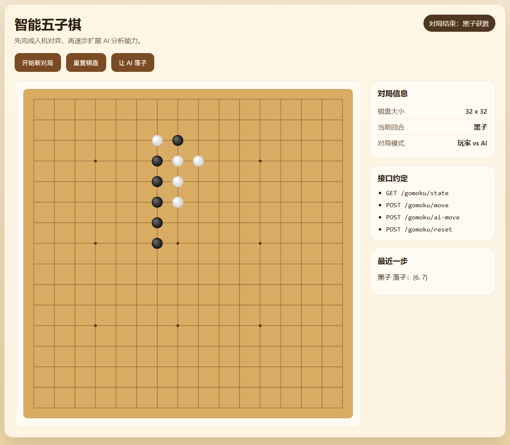

# AiAssistant_inCpp
AiAssistant_inCpp

通过muduo库搭建了网络服务器，实现了简单的在线聊天功能，支持多人同时在线聊天。同时，通过opencv库实现了图像处理功能，可以实时检测图像中的棋盘格，并进行相应的处理。此外，通过百度AI平台实现了语音识别和语音合成功能，可以实现语音输入和语音输出。通过这些功能，可以实现一个简单的在线聊天和图像处理的AI助手。

与ai对战的五子棋在线下棋平台，ai使用的ollama qwen2.5:7b模型，可以实现五子棋的在线对战。

