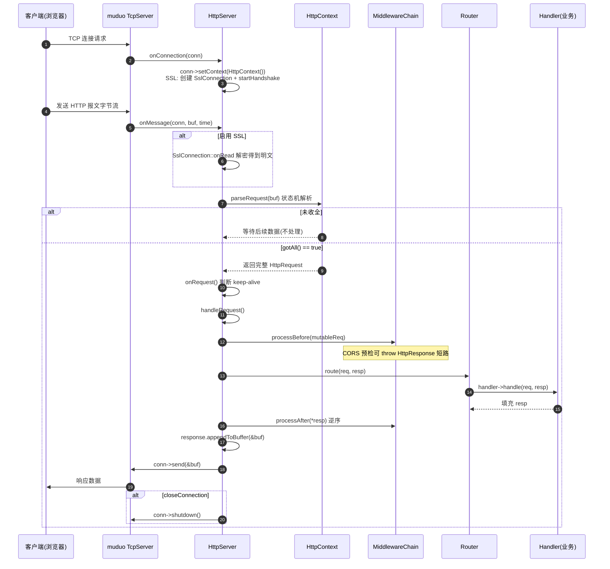
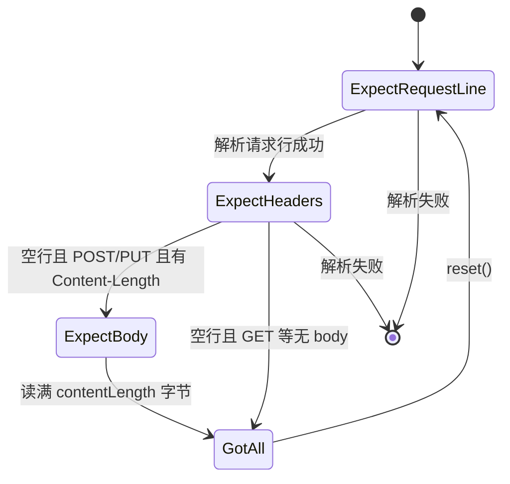
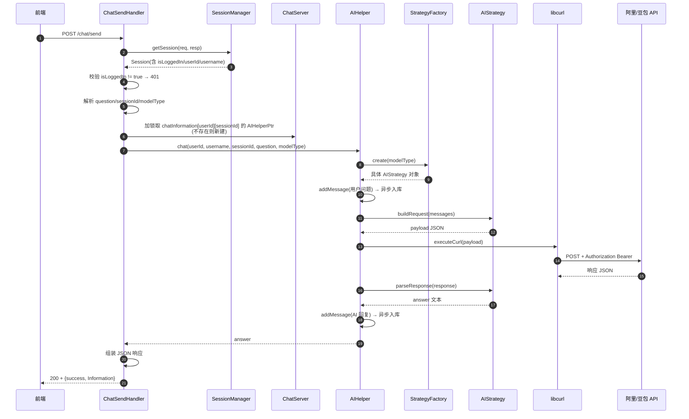
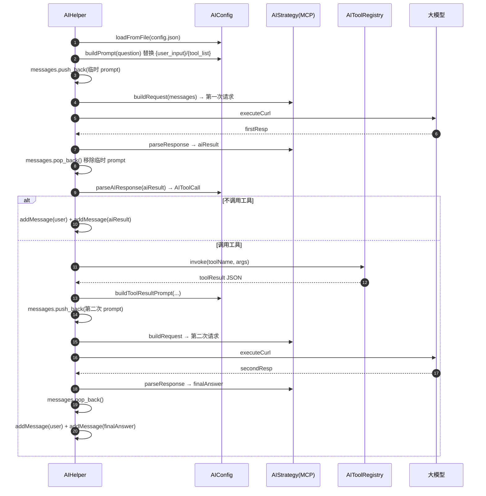
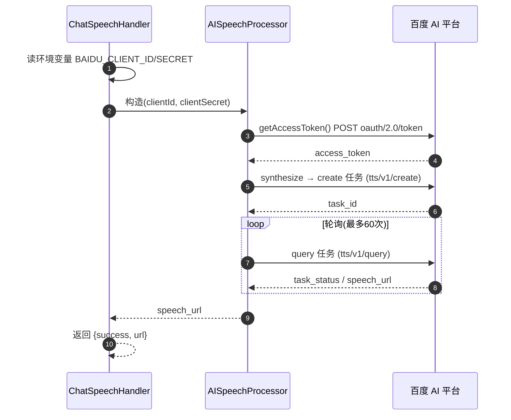
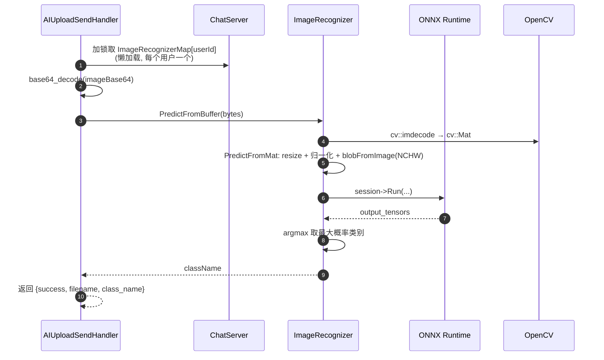
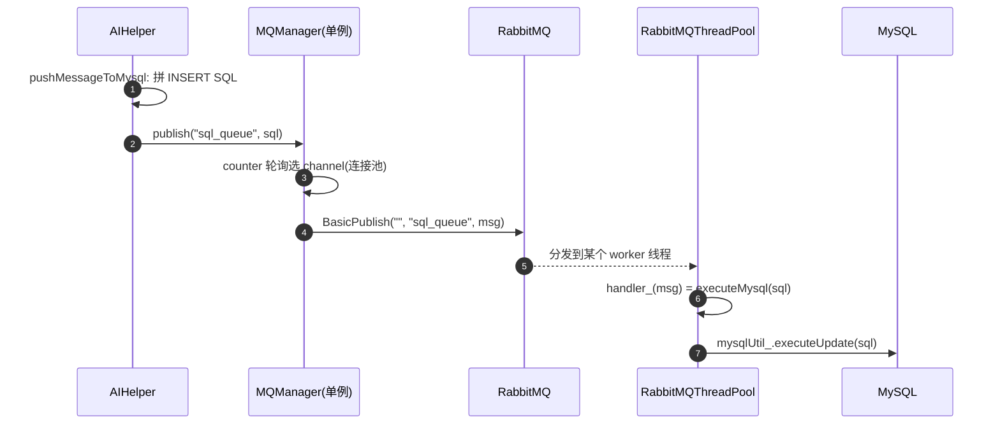
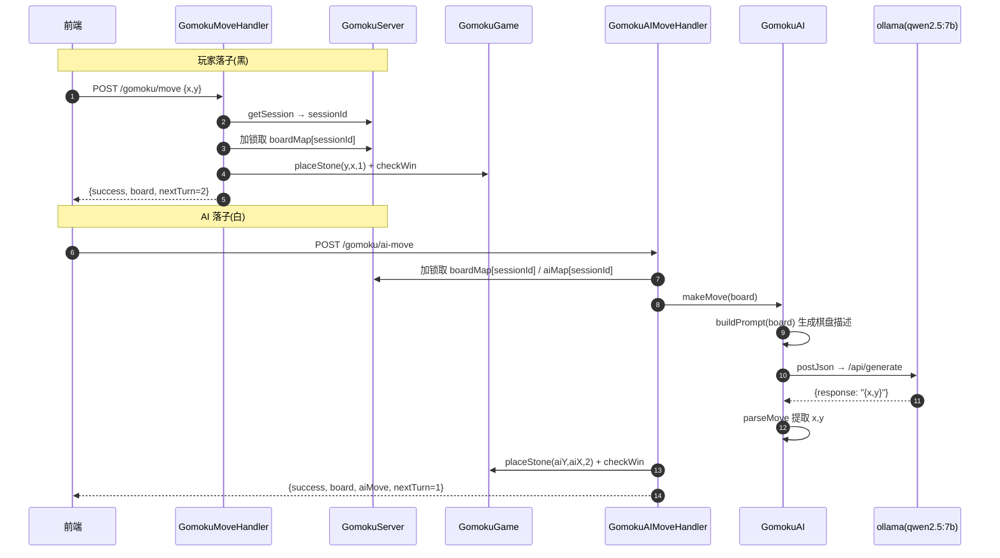
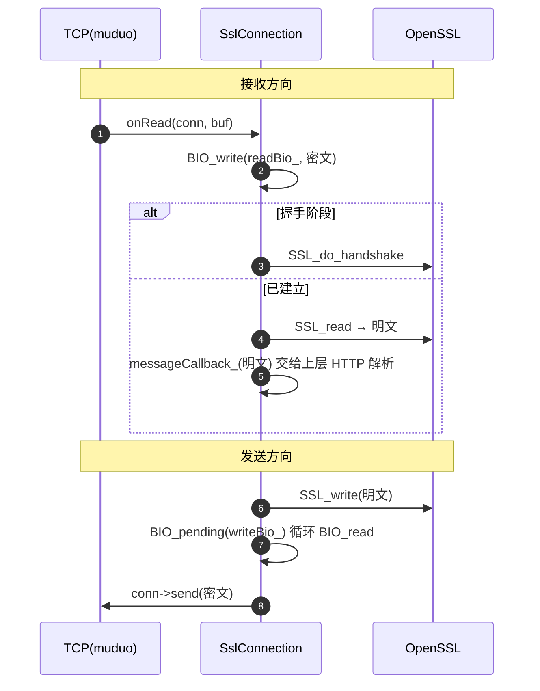

# AiAssistant_inCpp 项目解析 + 面试题手册

> 本文档从「数据接收与传递流程」出发，拆解整个项目每个模块的参与方式，给出 Mermaid 流程图，并对重点机制（动态路由、DB 连接池、MCP 两段式推理）做深度解析，最后按 **C++/并发、网络/框架、AI/架构** 三大类整理面试题与解答。

---

## 目录

1. [项目定位与整体架构](#1-项目定位与整体架构)
2. [目录结构与模块职责](#2-目录结构与模块职责)
3. [一次 HTTP 请求的完整数据流（框架层）](#3-一次-http-请求的完整数据流框架层)
4. [ChatServer 聊天主链路（业务层）](#4-chatserver-聊天主链路业务层)
5. [MCP 工具调用链路](#5-mcp-工具调用链路)
6. [语音合成（TTS）链路](#6-语音合成tts链路)
7. [图像识别链路](#7-图像识别链路)
8. [消息持久化（MySQL + RabbitMQ）链路](#8-消息持久化mysql--rabbitmq链路)
9. [GomokuServer 五子棋 AI 链路](#9-gomokuserver-五子棋-ai-链路)
10. [SSL/TLS 数据流](#10-ssltls-数据流)
11. [重点机制深度解析](#11-重点机制深度解析)
    - 11.1 [动态路由与正则匹配](#111-动态路由与正则匹配)
    - 11.2 [DB 连接池的归还与重连](#112-db-连接池的归还与重连)
    - 11.3 [MCP 两段式推理与 Prompt 构造](#113-mcp-两段式推理与-prompt-构造)
12. [面试题与解答（分类）](#12-面试题与解答分类)
    - 12.1 [C++ / 并发类](#121-c--并发类)
    - 12.2 [网络 / 框架类](#122-网络--框架类)
    - 12.3 [AI / 架构类](#123-ai--架构类)

---

## 1. 项目定位与整体架构

`AiAssistant_inCpp` 是一个 **C++17** 编写的「AI 助手」后端，本质上是**在 muduo 网络库之上自研的一个轻量级 HTTP 服务框架**，并在框架之上挂了两个业务应用：

- **ChatServer**：在线聊天 + 多模型接入（阿里/豆包）+ MCP 工具调用 + 百度语音 TTS/ASR + 本地图像识别（ONNX Runtime + OpenCV）。
- **GomokuServer**：与 AI 对战的五子棋，AI 使用本地 `ollama` 跑的 `qwen2.5:7b` 大模型。

核心技术栈（从 `CMakeLists.txt` 可见）：

| 组件 | 用途 |
|------|------|
| muduo_net / muduo_base | Reactor 网络库，事件驱动 |
| OpenSSL | TLS/SSL 加密（可插拔 HTTPS） |
| libcurl | 调用第三方 AI API（阿里/豆包/百度/ollama） |
| OpenCV + ONNX Runtime | 本地图像分类推理 |
| mysqlcppconn | MySQL 访问（连接池） |
| SimpleAmqpClient + rabbitmq | 消息队列，异步写库 |
| nlohmann/json (JsonUtil) | JSON 序列化 |

整体分层（自下而上）：

```
┌─────────────────────────────────────────────┐
│ 业务应用层  AIApps/ChatServer  AIApps/GomokuServer │
│  (Handlers + AIUtil + aigame)                │
├─────────────────────────────────────────────┤
│ HTTP 框架层  HttpServer/                     │
│  (HttpServer/Router/Middleware/Session/SSL/  │
│   HttpContext/HttpRequest/HttpResponse/utils) │
├─────────────────────────────────────────────┤
│ 网络层  muduo (EventLoop/TcpServer/... )      │
└─────────────────────────────────────────────┘
```

---

## 2. 目录结构与模块职责

```
AiAssistant_inCpp/
├── aiappmain/AiApp.cpp        # ChatServer 入口(main)
├── src/Gomoku.cpp             # GomokuServer 入口(main)
├── HttpServer/                # 通用 HTTP 框架层
│   ├── include/http/          # HttpServer/HttpContext/HttpRequest/HttpResponse
│   ├── include/router/        # Router / RouterHandler
│   ├── include/middleware/    # Middleware / MiddlewareChain / Cors
│   ├── include/session/       # Session / SessionManager / SessionStorage
│   ├── include/ssl/           # SslContext / SslConnection / SslConfig
│   └── include/utils/         # MysqlUtil / FileUtil / JsonUtil / db连接池
├── AIApps/
│   ├── ChatServer/
│   │   ├── include/handlers/  # 业务处理器(登录/聊天/TTS/上传等)
│   │   ├── include/AIUtil/    # AI能力中台
│   │   └── resource/          # html + config.json
│   └── GomokuServer/
│       ├── include/handlers/  # 五子棋处理器
│       ├── include/aigame/    # GomokuGame / GomokuAI
│       └── resource/          # gomoku.html/js/css
└── notes/                     # 各类设计笔记(文档)
```

### 框架层各模块职责

| 模块 | 职责 |
|------|------|
| `HttpServer` | 总调度器：持有 TcpServer/Router/Middleware/Session/SSL，把网络接入、协议解析、路由、横切逻辑、会话串起来 |
| `HttpContext` | HTTP 报文解析**状态机**（请求行→请求头→请求体→完成），每条连接一个 |
| `HttpRequest` / `HttpResponse` | 请求/响应对象，业务层唯一接触的数据模型 |
| `Router` | 请求分发：`method + path` → handler/callback，支持精准匹配与正则动态匹配 |
| `MiddlewareChain` | 横切逻辑编排：请求前顺序执行 `before`，响应后逆序执行 `after` |
| `CorsMiddleware` | 跨域处理（预检 + 响应头） |
| `SessionManager` / `Session` / `SessionStorage` | 基于 Cookie 的会话管理（内存存储，可替换） |
| `SslContext` / `SslConnection` | 基于 Memory BIO 的异步 TLS 加解密 |
| `MysqlUtil` / `DbConnectionPool` | MySQL 访问与连接池 |

### 业务层各模块职责（ChatServer）

| 模块 | 职责 |
|------|------|
| `ChatLoginHandler` / `ChatRegisterHandler` / `ChatLogoutHandler` | 登录/注册/登出 |
| `ChatSendHandler` / `ChatCreateAndSendHandler` | 聊天主入口，调 AIHelper |
| `ChatHistoryHandler` / `ChatSessionsHandler` | 历史消息 / 会话列表 |
| `ChatSpeechHandler` | 语音合成（TTS） |
| `AIUploadSendHandler` | 图片上传 + 识别 |
| `AIHelper` | 单会话级 AI 调度器：维护历史上下文、切策略、发起 curl、两段式 MCP |
| `AIStrategy` (+4 个实现) | 多模型适配抽象（阿里/豆包/RAG/MCP） |
| `AIFactory` | 策略工厂，编号→策略对象 |
| `AIConfig` / `AIToolRegistry` | MCP 工具调用的 Prompt 与工具执行 |
| `AISpeechProcessor` | 百度语音 OAuth/ASR/TTS |
| `ImageRecognizer` | ONNX + OpenCV 图像分类 |
| `MQManager` / `RabbitMQThreadPool` | 消息发布与消费线程池 |

---

## 3. 一次 HTTP 请求的完整数据流（框架层）

这是整个项目最重要的主链路。muduo 是 Reactor 模型：一个 mainLoop 负责 accept，多个 eventLoop 线程负责 IO 与业务。



### 关键点解析

1. **连接私有状态**：`onConnection` 里 `conn->setContext(HttpContext())`，保证每条 TCP 连接有独立的解析状态机，不共享。
2. **半包处理**：`onMessage` 收到数据 ≠ 一个完整请求，只有 `HttpContext::gotAll()` 为真才进 `onRequest`，避免 body 未读完就路由。
3. **回调解耦**：`onRequest` 只负责「创建响应对象 + 调用 `httpCallback_`」，而 `httpCallback_` 默认绑定到 `handleRequest`，把「网络接入」与「请求处理」拆开。
4. **中间件短路**：`CorsMiddleware::before` 对 OPTIONS 预检请求直接 `throw HttpResponse`，`handleRequest` 用 `catch(const HttpResponse&)` 捕获并作为最终响应。

`HttpContext` 状态机：



---

## 4. ChatServer 聊天主链路（业务层）

`POST /chat/send` 是聊天核心接口。请求体 `{question, sessionId, modelType}`。



### 关键点解析

- **策略模式 + 工厂模式**：`AIHelper` 不关心具体是哪家模型，通过 `StrategyFactory::instance().create(modelType)` 拿到 `AIStrategy`，编号映射为 `"1"→阿里, "2"→豆包, "3"→阿里RAG, "4"→阿里MCP`。
- **注册式扩展**：`AIStrategy.cpp` 底部用 `static StrategyRegister<AliyunStrategy> regAliyun("1")` 一行完成注册，新增模型不改工厂代码。
- **会话上下文**：`AIHelper` 内部维护 `std::vector<std::pair<std::string,long long>> messages`，偶数下标是用户消息、奇数下标是 AI 回复，`buildRequest` 据此交替生成 `role: user/assistant`。
- **用户态存储**：`ChatServer::chatInformation` 是 `unordered_map<int userId, unordered_map<string sessionId, shared_ptr<AIHelper>>>`，实现「一个用户多个 AI 会话」。

---

## 5. MCP 工具调用链路

当 `modelType="4"`（`AliyunMcpStrategy`，`isMCPModel=true`）时，`AIHelper::chat` 走两段式工具调用：



### 关键点解析

- **工具描述与工具实现分离**：`config.json` 里声明了模型「看得见」的工具（name/params/desc），而 `AIToolRegistry.cpp` 里注册了「真正执行」的工具（`get_weather`、`get_time`）。新增工具需两边同步改。
- **临时 prompt 的压栈/弹栈**：用 `messages.push_back(...)` 把带工具提示词的 prompt 临时加入上下文发请求，请求完成后立即 `pop_back`，保证历史对话不被污染。
- 内置工具 `get_weather` 调 `wttr.in`，`get_time` 返回本地时间。

> 更细的 Prompt 构造与两段式细节见 [11.3 节](#113-mcp-两段式推理与-prompt-构造)。

---

## 6. 语音合成（TTS）链路

`POST /chat/tts`，请求体 `{text}`。



### 关键点解析

- TTS 是**异步任务**：先 create 拿 `task_id`，再轮询 query 直到 `task_status=Success`，取 `speech_url`。
- 配置走环境变量，`AISpeechProcessor` 构造时即获取 token。

---

## 7. 图像识别链路

`POST /upload/send`，请求体 `{filename, image(base64)}`。



### 关键点解析

- **本地推理**：不依赖云端，模型 `mobilenetv2-7.onnx`，标签 `imagenet_classes.txt`（路径目前硬编码 `/root/...`）。
- 预处理三步：`resize` 到模型输入尺寸 → `convertTo(CV_32F, 1/255)` 归一化 → `blobFromImage` 转 NCHW。
- `ImageRecognizerMap` 按 userId 缓存识别器实例，避免每次请求重新加载模型。

---

## 8. 消息持久化（MySQL + RabbitMQ）链路

聊天消息的写库是**异步**的，用 RabbitMQ 做削峰与解耦。



### 关键点解析

- **为什么用 MQ**：写库是慢操作，直接在请求线程里写会拖慢聊天响应；丢给队列后，AI 回复可以立刻返回，写库由消费线程异步完成（流量削峰 + 解耦）。
- **生产者**：`MQManager` 单例维护 5 条 channel 连接池，`fetch_add` 轮询选择，避免单 channel 竞争。
- **消费者**：`RabbitMQThreadPool` 起多个 worker 线程，每线程独立 channel，`BasicQos(1)` 公平分发，收到消息调 `executeMysql`，然后 `BasicAck`。
- **启动恢复**：`ChatServer::readDataFromMySQL` 启动时读历史消息到 `AIHelper::restoreMessage`，重建会话上下文。

---

## 9. GomokuServer 五子棋 AI 链路

入口 `src/Gomoku.cpp`，端口 80，3 线程。玩家执黑，AI 执白。



### 关键点解析

- **AI 通过大模型落子**：`GomokuAI` 用 curl 调本地 `http://172.22.48.1:11434/api/generate`，模型 `qwen2.5:7b`，`stream=false`。`buildPrompt` 把棋盘非空点序列化成 `{x,y,v}` 列表喂给模型，要求只返回 `{"x":col,"y":row}`。
- **解析健壮性**：`parseMove` 先尝试整体 JSON 解析，失败后用正则 `"x":数字` 兜底提取。
- **坐标约定**：前端 `x=列, y=行`；棋盘内部 `board[row][col]`，所以落子调用 `placeStone(y, x, ...)`。
- **会话隔离**：`boardMap` / `aiMap` 都以 sessionId 为 key，每个登录会话一局棋。

---

## 10. SSL/TLS 数据流

`HttpServer` 支持可选 SSL，采用 **Memory BIO** 异步模式（`BIO_s_mem`）。



### 关键点解析

- 接收：TCP 密文 `BIO_write` 进 `readBio_` → `SSL_read` 解密 → 回调上层。
- 发送：`SSL_write` 写明文 → 从 `writeBio_` 循环 `BIO_read` 取密文 → `conn->send`。
- 设计上还有一套 `onEncrypted/onDecrypted` + custom BIO 的旧代码，实际未接入主流程（Memory BIO 才是当前真正运行的路径）。

---

## 11. 重点机制深度解析

### 11.1 动态路由与正则匹配

`Router` 需要同时支持「精准路径」和「带参数路径」两种匹配。精准路径直接用 `unordered_map` 哈希查找，动态路径则依赖「模式 → 正则」的转换。

#### 11.1.1 路径模式如何转正则

`Router.h` 里 `convertToRegex`：

```cpp
std::regex convertToRegex(const std::string &pathPattern)
{
    std::string regexPattern = "^" + std::regex_replace(
        pathPattern,
        std::regex(R"(/:([^/]+))"),   // 匹配 ":参数名"
        R"(/([^/]+))") + "$";          // 替换成捕获组
    return std::regex(regexPattern);
}
```

- `/:([^/]+)` 匹配 `/` 后紧跟 `:` 再跟一个或多个非 `/` 字符，即 `:id` 这种段。
- 替换成 `/([^/]+)`，把 `:id` 变成正则捕获组 `([^/]+)`。
- 前后拼 `^` 和 `$`，强制整条路径完整匹配，避免 `/user/1` 误匹配 `/user/1/profile`。

示例：`/user/:id` → `^/user/([^/]+)$`。

#### 11.1.2 注册时做了什么

```cpp
void addRegexHandler(HttpRequest::Method method, const std::string &path, HandlerPtr handler)
{
    std::regex pathRegex = convertToRegex(path);
    regexHandlers_.emplace_back(method, pathRegex, handler);
}
```

注册时就把 `method + pathRegex + handler` 打包成一个 `RouteHandlerObj` 塞进 `regexHandlers_` 向量。正则只需编译一次，匹配时复用。

#### 11.1.3 匹配与参数提取

`Router::route` 的匹配顺序是：

1. 精准 Handler（`handlers_` 哈希表）
2. 精准 callback（`callbacks_` 哈希表）
3. 动态 Handler（`regexHandlers_` 线性遍历）
4. 动态 callback（`regexCallbacks_` 线性遍历）

动态 Handler 分支：

```cpp
for (const auto &[method, pathRegex, handler] : regexHandlers_)
{
    std::smatch match;
    std::string pathStr(req.path());
    if (method == req.method() && std::regex_match(pathStr, match, pathRegex))
    {
        HttpRequest newReq(req);            // 复制一份，因为要往里面塞参数
        extractPathParameters(match, newReq);
        handler->handle(newReq, resp);
        return true;
    }
}
```

`extractPathParameters`：

```cpp
void extractPathParameters(const std::smatch &match, HttpRequest &request)
{
    for (size_t i = 1; i < match.size(); ++i)     // i=0 是整段匹配
    {
        request.setPathParameters("param" + std::to_string(i), match[i].str());
    }
}
```

**两个设计细节**：

- `match[0]` 是整段匹配，`match[1..]` 才是各捕获组，所以从 `i=1` 开始取。
- 参数名统一叫 `param1`、`param2`，**没有保留原始名字** `id`，这是当前实现的一个局限——语义不够强。

#### 11.1.4 为什么复制请求再处理

`route(const HttpRequest &req, ...)` 的参数是 `const` 引用，不能直接修改；而动态路由需要把路径参数塞进请求对象，所以复制一份 `newReq`，在副本上 `setPathParameters` 再交给 handler。这样既保持原始请求只读，又让 handler 能通过 `req.getPathParameter("param1")` 拿到参数。

#### 11.1.5 权衡

- 精准路由：O(1) 哈希查找，最快。
- 动态路由：线性遍历 `vector` + 正则匹配，路由数量多时 O(n) 变慢，适合中小规模项目。

---

### 11.2 DB 连接池的归还与重连

`DbConnectionPool` 是一个**单例**，负责 MySQL 连接的创建、获取、归还、失效重连。

#### 11.2.1 数据结构与初始化

```cpp
std::queue<std::shared_ptr<DbConnection>> connections_;  // 空闲连接队列
std::mutex mutex_;
std::condition_variable cv_;
bool initialized_ = false;
std::thread checkThread_;   // 后台检查线程
```

`init(host, user, password, database, poolSize)` 加锁后一次性 `createConnection()` 创建 `poolSize` 条连接 push 进队列（用 `initialized_` 防止重复初始化）。

#### 11.2.2 获取连接（关键：锁外 ping）

```cpp
std::shared_ptr<DbConnection> getConnection()
{
    std::shared_ptr<DbConnection> conn;
    {
        std::unique_lock<std::mutex> lock(mutex_);
        while (connections_.empty()) {          // 空则等待
            if (!initialized_) throw DbException("...not initialized");
            cv_.wait(lock);
        }
        conn = connections_.front();
        connections_.pop();
    }  // ← 这里释放锁

    if (!conn->ping()) {                        // 在锁外做网络 IO 检查
        conn = createConnection();               // 失效则重建
    }
    return std::shared_ptr<DbConnection>(conn.get(),
        [this, conn](DbConnection*) {            // 自定义删除器
            std::lock_guard<std::mutex> lock(mutex_);
            connections_.push(conn);             // 析构时归还
            cv_.notify_one();
        });
}
```

**为什么在锁外 `ping`**：`ping` 是网络往返 IO，若在锁内执行，会阻塞其他等待连接的线程，严重降低并发。所以先在锁内取队首，再释放锁做有效性检查。

#### 11.2.3 归还机制：shared_ptr 自定义删除器

这是本设计最巧妙的一点。返回的不是裸连接，而是一个**包了一层自定义删除器的 `shared_ptr`**。当业务代码用完连接、`shared_ptr` 引用计数归零时，自定义删除器被调用，把连接重新 push 回队列并 `notify_one` 唤醒等待线程。

- 好处：**RAII 自动归还**，调用方不用显式还连接，忘记归还也不会泄漏。
- 注意：删除器里 `conn` 是按值捕获的 `shared_ptr`，保证「归还的就是当初借出的那个连接」。

#### 11.2.4 后台健康检查线程

构造函数里 `checkThread_ = std::thread(&DbConnectionPool::checkConnections, this); checkThread_.detach();`

`checkConnections` 循环：
1. 加锁把队列里所有空闲连接拷贝到 `connsToCheck`（**避免在锁内做 IO**）；
2. 释放锁后逐个 `ping()`，失效的连接 `reconnect()`；
3. `sleep 60 秒` 进入下一轮。

这样即便某条空闲连接因 MySQL 重启而失效，也能在后台被检测并重连，下次借出时大概率可用。

---

### 11.3 MCP 两段式推理与 Prompt 构造

MCP（工具调用）本质是「模型先判断要不要调工具 → 执行工具 → 再基于结果回答」的 workflow，本项目的 Prompt 模板全部来自 `resource/config.json`。

#### 11.3.1 配置文件内容

```json
{
  "prompt_template": "我是一个第三方中间人...若需要调用工具，只需要输出json...以下是用户所说的话：{user_input}\n你可以使用以下工具:\n{tool_list}\n如果需要调用，请输出JSON格式: {\"tool\":\"工具名\",\"args\":{\"key\":\"value\"}}\n",
  "tools": [
    {"name": "get_weather", "params": {"city": "南京"}, "desc": "获取天气"},
    {"name": "get_time", "params": {}, "desc": "获取当前时间"}
  ]
}
```

`prompt_template` 里有两个占位符：`{user_input}` 和 `{tool_list}`。

#### 11.3.2 第一次 prompt 的构造

`AIConfig::buildPrompt(userInput)`：

```cpp
result = std::regex_replace(result, std::regex("\\{user_input\\}"), userInput);
result = std::regex_replace(result, std::regex("\\{tools_list\\}"), buildToolList());
```

其中 `buildToolList()` 把 `tools` 拼成一行行文本，例如：

```text
get_weather(city) → 获取天气
get_time() → 获取当前时间
```

这样模型第一轮就「知道」有哪些工具可用、参数长什么样，并被要求：**要么直接文本回答，要么只输出 `{"tool":..., "args":...}` JSON**。

#### 11.3.3 第一轮：判断是否调工具

`AIHelper::chat` 先 `messages.push_back(tempUserQuestion)`（临时把带工具列表的 prompt 加入上下文）→ 发第一次请求 → `parseResponse` 拿模型返回文本 → `messages.pop_back()` 移除临时 prompt。

`AIConfig::parseAIResponse(aiResult)`：

```cpp
json j = json::parse(response);
if (j.contains("tools") && j["tools"].is_string()) {   // 注意字段名是 "tools"
    result.toolName = j["tools"];
    if (j.contains("args") && j["args"].is_object())
        result.args = j["args"];
    result.isToolCall = true;
}
```

若解析成 JSON 且含 `tools` 字段，判定为工具调用；否则 `isToolCall=false` 当作普通回答。

#### 11.3.4 工具执行

```cpp
AIToolRegistry registry;               // 构造时注册 get_weather / get_time
toolResult = registry.invoke(call.toolName, call.args);
```

`AIToolRegistry::invoke` 从 `tools_` 映射查函数并执行。`get_weather` 会对城市名 `curl_easy_escape` 后拼 `https://wttr.in/<city>?format=3&lang=zh` 请求天气；`get_time` 用 `std::strftime` 返回本地时间字符串。

#### 11.3.5 第二轮：基于结果回答

`buildToolResultPrompt` 生成第二次 prompt：

```text
下面是用户说的话：<userInput>
我刚才调用了工具 [<toolName>] ，参数为：<toolArgs>
工具返回的结果如下：<toolResult>
请根据以上信息，用自然语言回答用户。
```

再次 `messages.push_back(secondPrompt)` → 第二次请求 → 拿到 `finalAnswer` → `pop_back`，最后才把「真正的用户问题 + 最终回答」通过 `addMessage` 写入历史（这样入库的才是干净对话，不带临时 prompt）。

**核心要点**：临时 prompt 用「压栈 → 发请求 → 弹栈」的方式进出 `messages`，既不污染持久化的历史，又能让模型带着工具上下文进行两轮推理。

---

## 12. 面试题与解答（分类）

### 12.1 C++ / 并发类

**Q1. 数据库连接池是怎么设计的？归还和重连分别怎么实现？**

**答**：`DbConnectionPool` 单例维护一个 `queue<shared_ptr<DbConnection>>` + `mutex` + `condition_variable`。`getConnection` 加锁取队首（空则 `cv_.wait`），**释放锁后**再 `ping` 检查有效性，失效则 `createConnection` 重建。归还靠 `shared_ptr` 自定义删除器：引用计数归零时把连接 push 回队列并 `notify_one`（RAII 自动归还）。重连靠一个 detach 的后台线程每 60 秒把空闲连接拷贝到锁外逐个 `ping`/`reconnect`。

**Q2. 为什么归还连接用 `shared_ptr` 自定义删除器，而不是让调用方显式还连接？**

**答**：用 RAII 保证「用完自动归还」，调用方无需记住 `release()`，即使中途抛异常或提前 return 也不会泄漏连接。删除器里按值捕获原 `shared_ptr`，保证归还的是当初借出的那条连接，归还后 `notify_one` 唤醒等待线程。

**Q3. `getConnection` 里为什么要在锁外做 `ping`？**

**答**：`ping` 是网络 IO，会阻塞。如果在锁内执行，其他想借连接的线程会被长时间挡住，并发能力骤降。所以「在锁内只做队列的取/放，耗时检查一律放到锁外」，这是连接池的常见并发优化。

**Q4. `ChatServer::chatInformation` 为什么设计成 `unordered_map<int, unordered_map<string, shared_ptr<AIHelper>>>`？并发怎么保护？**

**答**：外层 key 是 userId（一个用户），内层 key 是 sessionId（一个用户可有多个 AI 会话），value 是每会话独立的 `AIHelper`（保存该会话历史消息）。多事件循环线程并发访问，用 `mutexForChatInformation` 保护，handler 通过 `lock_guard` 加锁后再读写。

**Q5. MQ 生产端怎么保证线程安全？为什么用连接池而不是单 channel？**

**答**：`MQManager` 维护 5 条 `MQConn`（channel + 各自 `mutex`），`publish` 用 `counter_.fetch_add(1) % poolSize_` 轮询选连接，再对该连接加锁发布。连接池 + `std::atomic` 轮询能分散锁竞争、提升吞吐，避免所有线程抢一把锁。

**Q6. 消费者线程池的公平分发（QoS）怎么实现？**

**答**：每个 worker 线程持有独立 channel，`BasicConsume` 注册消费者，`BasicQos(consumer_tag, 1)` 设 prefetch=1，表示「处理完当前消息前不推送新消息」，实现公平分发；消费后 `BasicAck` 确认。

**Q7. 项目里用到了哪些单例？怎么实现线程安全？**

**答**：`MQManager::instance()`、`StrategyFactory::instance()`、`DbConnectionPool::getInstance()` 都是单例。前两者用 C++11 的「函数内 static 局部变量」实现（`static X x; return x;`），由编译器保证线程安全的惰性初始化；`DbConnectionPool` 内部用 `mutex` 保护队列。

**Q8. 多模型接入用了什么设计模式？新增模型要改哪里？**

**答**：策略模式 + 工厂模式 + 注册机制。`AIStrategy` 定义统一接口（getApiUrl/getApiKey/getModel/buildRequest/parseResponse），四个子类实现不同厂商；`StrategyFactory` 维护 `name→Creator` 映射。新增模型只需继承 `AIStrategy` 写一个类，再在 `.cpp` 里加一行 `static StrategyRegister<XxxStrategy> reg("编号")`，工厂代码零改动。这体现了「开闭原则」。

**Q9. 解释 `StrategyRegister` 模板是如何实现自动注册的？**

**答**：`StrategyRegister<T>` 是模板结构体，构造函数里调用 `StrategyFactory::instance().registerStrategy(name, lambda)` 把「名字→创建 T 的函数」注册进工厂。`.cpp` 里的 `static StrategyRegister<AliyunStrategy> reg("1")` 是全局静态对象，程序启动时其构造函数自动执行完成注册，无需手动调用。

**Q10. 这个项目里哪些地方用到了智能指针？为什么选择对应类型？**

**答**：`unique_ptr` 用于独占所有权（`SessionManager`、`SslContext`、`ImageRecognizer` 的 `Ort::Session`）；`shared_ptr` 用于共享/带删除器的场景（`AIHelper` 被 `chatInformation` 与 handler 共享、`DbConnection` 用自定义删除器归还）；`weak_ptr` 未直接使用。`enable_shared_from_this` 用在 `Session` 上，便于在成员函数内安全取得自身 `shared_ptr`。

---

### 12.2 网络 / 框架类

**Q11. muduo 是怎么被用起来的？描述一次请求从网卡到业务的完整链路。**

**答**：muduo 是 Reactor 网络库。`HttpServer` 构造时 `initialize()` 把 `onConnection`/`onMessage` 注册为 `TcpServer` 回调；`start()` 调 `server_.start()` + `mainLoop_.loop()`。链路：`TcpConnection` 建立 → `onConnection` 设置 `HttpContext` → 数据到达 `onMessage` → `HttpContext::parseRequest` 状态机解析 → `gotAll()` 后 `onRequest` → `handleRequest` → 中间件 before → `Router::route` → handler → 中间件 after → `appendToBuffer` → `conn->send`。

**Q12. 为什么每条 TCP 连接挂一个 `HttpContext` 而不是全局共享？**

**答**：TCP 是字节流无消息边界，一个连接上的数据不一定一次到齐，HTTP 解析需要状态机持续累积；不同连接进度不同不能共享状态。所以 `HttpContext` 放连接级（`conn->setContext`），是高并发服务标准的「连接私有状态」设计。

**Q13. 框架怎么处理 TCP 半包/粘包？**

**答**：`HttpContext` 状态机（请求行→请求头→请求体→完成）持续推进，只有 `state_==GotAll` 才认为请求完整；带 body 的请求只有 `readableBytes() >= contentLength` 才读取，否则等待后续数据。半包不会被误处理，粘包按 Content-Length 切分。

**Q14. Router 支持哪几种路由形式？动态路由匹配的完整流程？**

**答**：4 种：精准+Handler、精准+callback、动态+Handler、动态+callback。精准用 `unordered_map<RouteKey>` 哈希查找；动态路由注册时把 `/user/:id` 经 `convertToRegex` 转成 `^/user/([^/]+)$` 存进 vector，匹配时 `regex_match` 命中后复制请求、`extractPathParameters` 提取 `param1/param2` 再调 handler。命中顺序：精准 Handler → 精准 callback → 动态 Handler → 动态 callback。

**Q15. 动态路由为什么复制 `HttpRequest` 再填参数？路径参数名为什么是 `param1`？**

**答**：`route` 的入参是 `const HttpRequest&` 不可改，需要把捕获组结果塞进请求，所以复制 `newReq` 再 `setPathParameters`，既保持原请求只读又让 handler 能取到参数。当前 `extractPathParameters` 统一命名 `param1/param2`，没有保留 `:id` 的原始名字，是语义上的局限（理想实现应保留参数名）。

**Q16. 中间件为什么请求前顺序执行、响应后逆序执行？CORS 预检为何用 `throw HttpResponse`？**

**答**：洋葱模型——请求从外到内过 `before`，响应从内到外过 `after`，最外层最先见请求、最后见响应。CORS 预检（OPTIONS）非业务请求，`before` 直接构造 `HttpResponse` 并 `throw`，`handleRequest` 用 `catch(const HttpResponse&)` 捕获作为最终响应，实现短路，避免进路由。

**Q17. Session 如何实现和传递？存哪？怎么扩展成 Redis？**

**答**：`getSession` 从 Cookie 取 `sessionId`，有则 `load`，无/过期则 `generateSessionId`（32 位十六进制，`mt19937`）新建并 `Set-Cookie` 写回。当前 `MemorySessionStorage`（`unordered_map<string, shared_ptr<Session>>`），`Session` 存键值对。因抽象了 `SessionStorage` 接口，改 Redis 只需新写一个 `RedisSessionStorage` 并在 `initializeSession` 替换，业务层与 `SessionManager` 不动。

**Q18. keep-alive 与 close 是怎么判断的？由谁负责？**

**答**：`onRequest` 里判断 `Connection: close` 或 `HTTP/1.0` 非 `Keep-Alive` 则 `close=true`，构造 `HttpResponse(close)`；发送后若 `closeConnection()` 则 `conn->shutdown()`。这个判断属于协议层通用规则，放在框架层 `onRequest`，业务 handler 不用关心。

**Q19. 404 是由 Router 生成还是 HttpServer 生成？为什么？**

**答**：由 `HttpServer::handleRequest` 生成。`Router::route` 只返回 bool 表示「是否命中」，不构造协议响应；`HttpServer` 拿到 false 后统一 `setStatusCode(404)`。这样 Router 只管「分诊」，HttpServer 管「HTTP 语义回应」，职责分离清晰。

**Q20. SSL 用 Memory BIO 是怎么工作的？**

**答**：接收方向 TCP 密文 `BIO_write` 进 `readBio_` → `SSL_read` 解密成明文 → 回调上层 HTTP 解析；发送方向 `SSL_write` 写明文 → 从 `writeBio_` 循环 `BIO_read` 取密文 → `conn->send`。握手阶段先 `SSL_do_handshake`，遇到 `WANT_READ/WANT_WRITE` 表示需要更多数据。这是适配 Reactor 的异步 TLS 标准做法（对照 nginx/libevent-openssl）。

---

### 12.3 AI / 架构类

**Q21. MCP（工具调用）本质是什么？项目里两段式推理怎么实现？**

**答**：本质是「模型判断是否调工具 → 执行工具 → 基于结果回答」的工作流。第一轮把工具列表描述拼进 prompt，让模型输出 `{"tool":..., "args":...}` 或直接文本；`AIConfig::parseAIResponse` 判断是否工具调用；若是，`AIToolRegistry::invoke` 执行工具，`buildToolResultPrompt` 拼第二轮 prompt 再请求模型得到自然语言答案。临时 prompt 用「压栈→发请求→弹栈」进出 `messages`，不污染持久化历史。

**Q22. 聊天消息为什么要走 RabbitMQ 而不是直接同步写 MySQL？**

**答**：写库慢，同步写会阻塞请求、拖慢聊天响应。异步后 AI 回复立即返回，SQL 进 `sql_queue` 由消费线程慢慢写，实现流量削峰与业务解耦（MySQL 短暂故障也有队列缓冲，不直接报错）。

**Q23. 图像识别为什么用 ONNX Runtime + OpenCV 而非云端 API？预处理做了什么？**

**答**：本地推理可离线、低延迟、数据不出本地。预处理：`resize` → `convertTo(CV_32F, 1/255)` 归一化 → `blobFromImage` 转 NCHW → 构造 `Ort::Value` → `session->Run` → `argmax` 取最大概率类别。每用户缓存一个 `ImageRecognizer` 避免重复加载模型。

**Q24. 五子棋怎么「让大模型落子」？如何保证落点合法？**

**答**：`buildPrompt` 把非空点序列化成 `{x,y,v}` 列表 + 写死策略优先级，要求只输出 `{"x":col,"y":row}`；curl 调本地 ollama `/api/generate`（stream=false）；`parseMove` 先整体解析 JSON、失败再正则兜底。拿到坐标后 `placeStone` 校验越界/占用，非法丢弃重试（最多 3 次）。

**Q25. 项目分层设计对扩展新应用（如翻译应用）有什么好处？**

**答**：`HttpServer` 是通用框架层，Router/Middleware/Session/SSL 可复用；业务应用只需像 `ChatServer`/`GomokuServer` 那样持有 `httpServer_`，注册路由、初始化中间件与会话、写 Handler。框架层不关心业务，业务层不碰网络/协议细节，新增应用只需新模块 + 一套 Handler，复用整套框架。

**Q26. 你在这个项目里发现哪些可改进点？**

**答**：
1. **SQL 注入风险**：`pushMessageToMysql` 拼接 SQL（`sessionId` 未转义），应全改参数化查询。
2. **密码明文**：`users` 表直接存密码，应哈希加盐。
3. **硬编码**：模型/标签路径、MQ 参数、ollama 地址都应抽到配置。
4. **SSL 遗留代码**：`onEncrypted/onDecrypted` + custom BIO 未接入，可清理。
5. **动态路由参数名** `param1` 语义弱，应保留 `:id` 原名。
6. **MQ 消费端 auto-ack 与手动 Ack 混用**，应统一。
7. **TTS 轮询在请求线程 sleep**，长耗时，可异步化。

**Q27. 讲一下你对 Reactor 模型在这个项目里的理解。**

**答**：muduo 是 Reactor：`EventLoop` 是事件循环，`TcpServer` 监听，`onConnection/onMessage` 是事件回调；`setThreadNum` 设 IO/业务线程数。`HttpServer` 把「事件到来」转成「解析 + 路由 + 业务」的同步调用链。核心：不阻塞事件循环、回调解耦、每连接独立状态。适合 IO 密集高并发网络服务。

**Q28. 如果要把 AI 回复改成流式（stream）返回给前端，大概要动哪些地方？**

**答**：当前 `AIHelper::executeCurl` 是等整个响应一次性拿回后解析。改流式需要：`buildRequest` 设 `"stream": true`，curl 用 `CURLOPT_WRITEFUNCTION` 增量接收分片并解析 SSE（`data:` 行）；但框架层 `HttpResponse` 目前是「handler 填完整 body → appendToBuffer → 一次 send」，需要新增「分块/长连接边生成边发送」的响应能力（Chunked Transfer 或 WebSocket），属于对 `HttpResponse`/`onRequest` 发送路径的扩展。

**Q29. 解释 `AIHelper::chat` 里 `messages.pop_back()` 的作用，为什么不直接把它留在上下文里？**

**答**：第一次的 `tempUserQuestion` 和第二次的 `secondPrompt` 都包含了工具列表/工具结果的中间提示词，属于「过程性」内容，不是真正的用户/助手对话。若留在 `messages`，后续 `addMessage` 会把这些提示词当历史一起持久化和回传，污染上下文并让模型困惑。所以发完请求立即 `pop_back`，只把真正的 user 问题和最终回答写入历史。

**Q30. 这个项目的整体设计思想用一句话概括？**

**答**：**分层、解耦、面向扩展** —— 网络层(muduo)、协议层(HttpContext)、路由层(Router)、横切层(Middleware)、状态层(Session)、业务层(Handler) 各司其职，通过「组合 + 回调 + 接口抽象」而非巨型继承组织代码，是一个教学价值高、架构方向清晰的 C++ Web 框架 + AI 应用项目。
